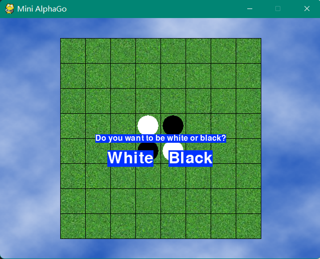
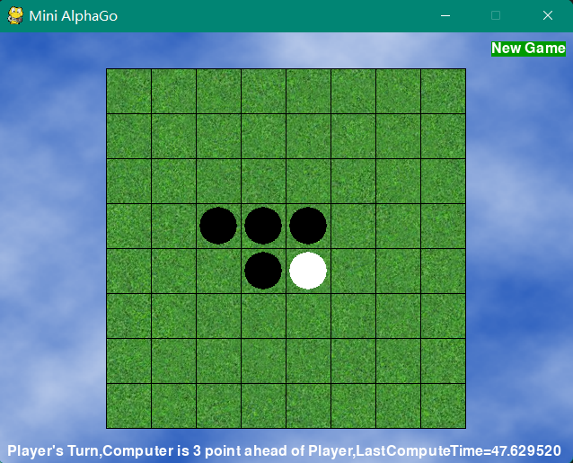
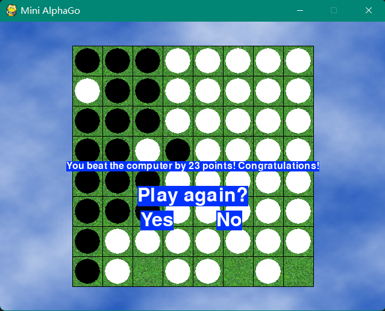
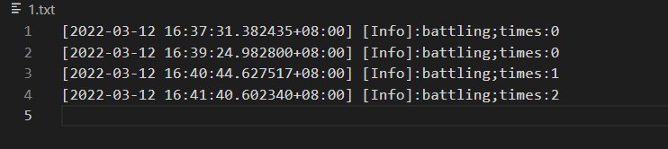

# 人工智能导论大作业1——黑白棋

## PB19061294 武汉

[toc]

## 写在前面

### 一点说明

当时留这个作业的时候，就觉得很有意思，然后之前对 AlphaZero 也有一定的了解，知道 AlphaZero 也是部分基于蒙特卡洛树搜索实现的，因此就想挑战一下自己，将 AlphaZero 在黑白棋上复现一遍来更好的理解深度强化学习。当然，Google 的钞能力我们比不了，因此我也会对 AlphaZero 进行一些修改，即使这样，短时间低算力我也没能跑出可用的模型。交作业的前三四天左右，我同学提醒我还需要实现可视化界面，由于深度强化学习那里的蒙特卡罗树用到了 Q-learning 相关的东西，没办法直接迁移数据结构，所以只能重新来写相关的内容。我发现这个大作业同时也是浙江大学 AI 导论的大作业，而他们的大作业提供了比较清晰可复用的 board 类接口。于是我借鉴了官方给的 board 类，为了提高效率，将列表改为了 numpy 矩阵，删去了字符串表示法的有关内容。这样复写蒙特卡罗树和节点的工作轻松了不少。至于可视化，我使用了 pygame 库进行开发，可以达到美观直接的效果。

### 关于黑白棋

黑白棋这个已经说的很清楚了，它是一个经典的策略游戏。一般棋子双面为黑白两色，故称”黑白棋“;因为行棋之时将对方棋子翻转，变为己方棋子，故又称”翻转棋“，我玩了几盘，感觉它虽然总的状态空间没有那么多，但是后期很容易出现大幅的比分变动，因此觉得也别有一番特色。游戏规则如下：

1. 黑方先行，双方交替下棋。

2. 一步合法的棋步包括：
   1. 在一个空格处落下一个棋子，并且翻转对手一个或多个棋子；
   2. 新落下的棋子必须落在可夹住对方棋子的位置上，对方被夹住的所有棋子都要翻转过来 
   3. 可以是横着夹，竖着夹，或是斜着夹。夹住的位置上必须全部是对手的棋子，不能有空格；
   4. 一步棋可以在数个（横向，纵向，对角线）方向上翻棋，任何被夹住的棋子都必须被翻转过来，棋手无权选择不去翻某个棋子。  

3. 如果一方没有合法棋步，也就是说不管他下到哪里，都不能至少翻转对手的一个棋子，那他这一轮只能弃权，而由他的对手继续落子直到他有合法棋步可下。

4. 如果一方至少有一步合法棋步可下，他就必须落子，不得弃权。  

5. 棋局持续下去，直到棋盘填满或者双方都无合法棋步可下。  

6. 如果某一方落子时间超过 1 分钟 或者 连续落子 3 次不合法，则判该方失败。 

### 关于 AlphaZero

2016年初，AlphaGo 战胜李世石，核心技术深度强化学习受到人们的广泛关注和研究。在此之后， AlphaGo 经历了几轮迭代。最新的成就就是 AlphaZero。这是一个基于深度强化学习的系统，只需要了解游戏的规则就可以自我对弈不断更新自己的决策模型。并且更重要的一点是，AlphaZero 和它的父辈们不同，它可以应用于所有的完全信息博弈。


## 实验环境

开发、运行环境：

```
python 3.8.5
numpy 1.18.5
torch 1.9.0
pytz 2020.1
```

## 实验内容

因为实际上写了两部分，那我就按照 非AlphaZero部分 和 AlphaZero 部分来讲吧

### 非AlphaZero部分

#### board 类

 棋盘规格是 8x8，0 代表 没有棋子，1代表白子，-1代表黑子。

一些被调用的方法如下：

- `get_legal_actions(color)`： 根据黑白棋的规则获取 color 方棋子的合法落子坐标
- `_move(action, color)`：  根据 color 落子坐标 action 翻转棋盘。
- `_can_fliped(action, color)`  根据 color 落子坐标 action 判断是否可以翻转。

#### MCTS 类

 MCTS分为四个部分, 选择, 扩展, 模拟, 反向传播. 我在MCTS类里也实现了相关功能

- `choice(Node)`选择最值得看的子节点/未拓展的子节点
- `maxValue(Node,color)`判断值得程度
- `expand(Node)`：扩展节点到当前树下方子节点
- `simulate(board,color)`当前棋局下随机快速 roll out
- `backup(node, reward)`回溯、更新节点参数

- `decision(board,color,times)`综合上述步骤的决策函数

#### Pygame 相关

这里主要实现了事件相关的操作，比如

- `drawBoard(board)`绘制当前棋盘
- `getSpaceClicked(mousex, mousey)`处理当前点击到的是否是、是哪个格子
- `drawInfo(board, playerTile, computerTile, turn,tms)`绘制 Info 信息

等等

#### 实现效果



用户可以自定义自己执黑还是执白，至于谁先手随机决定，这里我们执白。



可以看到开局后下面会显示战局情况，人机谁有几目优势，以及上一次计算机计算了多长时间。这里模拟次数是500轮，刚开局的时间大约是47s左右，后面的时间会变得比较短，大概到接近终局的时候可以在8s之内完成决策。



这是终局的场景，为了快速演示一遍，这里模拟次数设置为了5，可以发现这个 AI 比较弱。在模拟次数为 500 时，虽然中前局感觉上可以力压 AI 但是到后面往往会被扳平或者反超。

### AlphaZero部分

对于 AlphaZero 部分，我为了迎合神经网络需要做的工作，改造了 MTCSTree 。实现了TrainSet、Node、MTCSTree、PlayGames、Model、CNN 等类，具体实现见代码，这个代码跑起来经过测试没有问题，但是生成新模型的时间太长了(设置的参数是每步搜索800次，自我对弈100局之后再评估100局为一轮)，下面简单介绍一下。

#### Node 类

这个类里面要考虑的东西其实不少，每次的 MTCS 树更新的参数要有，每次更新棋盘可行步骤要有，反转棋盘要有，修改交替1、-1状态也要有，这个类就是蒙特卡洛树的结点类

#### PlayGames类

这个类定义了自我对弈的一些规范和参数，其实也是评估时用的类，因此它包括黑白双方使用的模型，胜率情况，自我对弈的实现等。

#### TrainSet和神经网络

这部分原论文用的是深度残差神经网络，因为复杂度原因，我替换成了简单的两次卷积的CNN模型，大致思路是首先生成一个初始随机模型，MTCS 树在第一次遇到子节点的时候 expand 它，然后利用神经网络评估当前的局面并沿原路返回顶端沿途更新信息。关于 MTCS 树搜索的其余部分同上小节所述，在此不再重复。神经网络我采用了8 * 8的输入，也就是只输入当下的状态，与之不同的是，原论文采用了输入之前八次的总棋盘。这里也是为了减少数据量做的让步。最后的输出为1 * 65的向量，这样其中一个是该状态下的胜率，另外64个是选择走法的概率矩阵。

#### 实现效果

对于 AlphaZero ,我给出运行时的状态图(这个是我写了一个log函数把信息重定向到log文件中了，当时是测试阶段，每次只对弈了四局)



### 分析和总结 

自己实现了 MCTS 算法, 也使用 Pygame 做了游戏的用户界面, 有计算和显示 miniAlphaGo 每一步所花费的时间, 以及总时间,最后也照着原论文自己手写了一遍 AlphaZero 的算法。但是实际运行的时候发现，MCTS 算法在中前期其实是效率很低的算法，模拟的 500 次费时还不能保证一个比较好的效果，这一点也是可以理解的，毕竟前期状态空间比较大。如果使用 C++/C 写蒙特卡洛相关代码可能会快很多，但是也只是一个数量级的差别，我认为最终结果对局前期的效果可能也不会很好。我和 AI 进行对弈，发现 AI 对中后局的把控能力很强，但是因为前期把握不住优势所以最后的比分优势往往不大。使用网上的在线 AI 和我的 AI 对比发现，MTCS 写的 AI 还比不过贪心算法。所以或许可以通过加入一些启发式条件或者在 roll out 时使用现有的评估函数做一些修正。

当然，使用深度强化学习可以很好的解决这个问题，就是模型难以得到。截止 ddl 之前，我的 AlphaZero 黑白棋算法模型还没有得到让人满意的效果。
